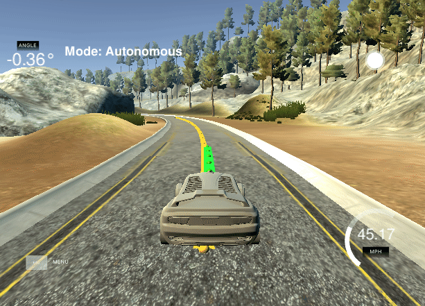

# Model predictive control for the autonomous vehicle based on the ACADO library
Model predictive control project for longitudinal and lateral control of the autonomous vehicles. It uses [ACADO](https://acado.github.io/) library. The simulator is from the udacity, [self driving car engineer course](https://www.udacity.com/course/self-driving-car-engineer-nanodegree--nd013) 

## Result



## Features

* This repository uses the ACADO library for MPC solver

## Dependencies

- cmake >= 3.5
- All OSes: [click here for installation instructions](https://cmake.org/install/)
- make >= 4.1(mac, linux), 3.81(Windows)
  - Linux: make is installed by default on most Linux distros
  - Mac: [install Xcode command line tools to get make](https://developer.apple.com/xcode/features/)
  - Windows: [Click here for installation instructions](http://gnuwin32.sourceforge.net/packages/make.htm)
- gcc/g++ >= 5.4
  - Linux: gcc / g++ is installed by default on most Linux distros
  - Mac: same deal as make - [install Xcode command line tools]((https://developer.apple.com/xcode/features/)
  - Windows: recommend using [MinGW](http://www.mingw.org/)
- git-lfs

## Installation

- [uWebSockets](https://github.com/uWebSockets/uWebSockets)
  - Run either `install-mac.sh` or `install-ubuntu.sh`.
- [Eigen](http://eigen.tuxfamily.org/index.php?title=Main_Page). This is already part of the repo so you shouldn't have to worry about it.
- Simulator. You can download these from the [releases tab](https://github.com/udacity/self-driving-car-sim/releases).
- Not a dependency but read the [DATA.md](https://github.com/udacity/CarND-MPC-Project/blob/master/DATA.md) for a description of the data sent back from the simulator
- ACADO environment set-up
  - Install ACADO tool-kit follow this [link](https://acado.github.io/install_linux.html)
  - Please follow this [link](https://sourceforge.net/p/acado/wiki/Using%20CMake%20-%20UNIX%20-%20Common/) in order to build ACADO based executables outside ACADO source tree

## Compiling and Running

```shell
# 1. Code generation 
cd acado_code_generator
mkdir build && cd build
cmake ..
make
./mpc

# 2. Build ACADO static library
mv simple_mpc_export/* ../../acado_mpc_export/
cd ../../acado_mpc_export
make

# 3. Build project
cd ../
mkdir build && cd build
cmake ..
make

# 4. Run
./mpc

# 5. Open the simulator
Open new terminal
cd term2_sim_linux
./term2_sim.x86_64
click the project 5: MPC Controller
```


